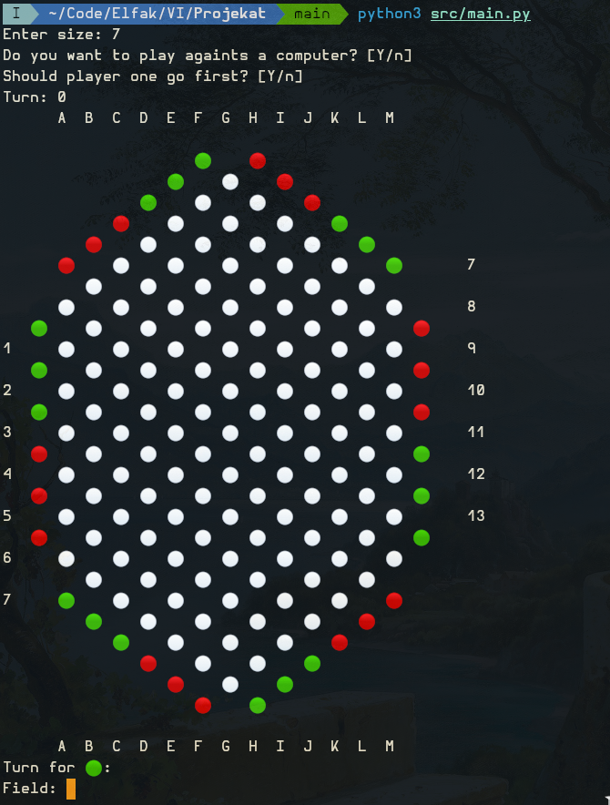

# Atol - VI projekat

Projekat iz predmeta Veštačka inteligencija

Tim:
- Marko Petrović (19317) 
- Aleksandar Ristić (19340)
- Nina Paunović (19515)



Trenutna faza:
- [x] 1
- [ ] 2
- [ ] 3

## Dokumentacija

- [Faza 1](https://github.com/ikugo-dev/vi-projekat/blob/main/documentation/F1.pdf)

## Instalacija

Neophodan je python3 (ili samo python ako ste na Windows-u) za pokretanje projekta

```bash
git clone https://github.com/ikugo-dev/vi-projekat
cd vi-projekat
python3 src/main.py
```
